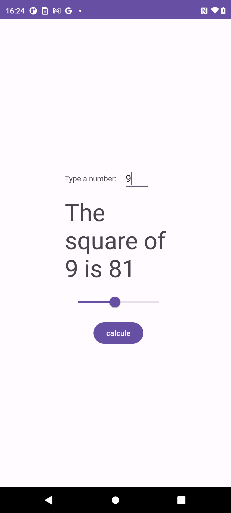

# AndroidCustomView
## An Android App Sample of how to create a Constraint Layout Custom View with Listeners

* Kotlin
* Custom View
* ConstraintLayout
* Higher order functions

## Reference
* https://jordandixoncom.wordpress.com/2017/12/30/custom-views-with-constraint-layout-and-kotlin/
* https://www.geeksforgeeks.org/kotlin-higher-order-functions/